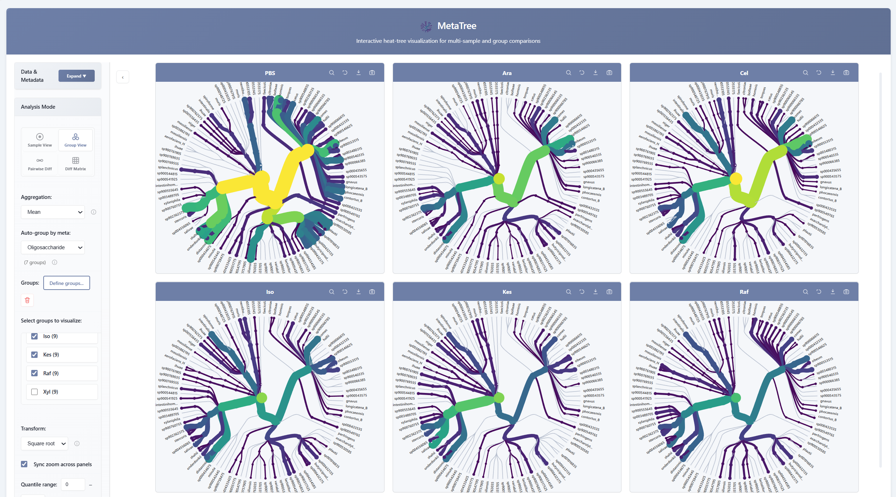

# MetaTree

**MetaTree** is a modern, web-based platform for visualizing and comparing hierarchical data. It maps quantitative values to node size, color, and branch width, making it easy to explore patterns and group differences across samples while preserving full hierarchical context.



## Key Features

*   **Comparative Visualization**: Designed for group contrasts (e.g., treatment vs. control) and comparisons on shared hierarchies.
*   **Multiple Modes**:
    *   **Individual (Sample View)**: Heat-tree matrices for single samples.
    *   **Group / Aggregated (Group View)**: Automatically aggregate samples by metadata.
    *   **Two-Group Comparison (Pairwise Diff)**: Direct comparison with effect size and significance-aware styling.
    *   **Multi-Group Comparison (Diff Matrix)**: Simultaneous visualization of multiple group contrasts.
*   **Flexible Inputs**: Supports both hierarchical abundance tables (wide format) and differential statistics tables (long format).
*   **Rich Customization**: Adjust layouts (radial, tree, packing), color schemes, transforms (log, sqrt), and filtering without writing code.
*   **Publication-Ready Export**: Export high-quality SVG and PNG images directly from the browser.

## Quick Start

### Online (Recommended)
Access the latest version of MetaTree directly in your browser:
**[Launch MetaTree Online](https://byemaxx.github.io/MetaTree/)**

### Local Usage
You can run MetaTree locally, but for full functionality (especially image export), we recommend using a local web server to avoid browser security restrictions on `file://` protocols.

**Option A: Simple Server**
If you have Python installed:
```bash
# Run in the project directory
python -m http.server 8000
# Then open http://localhost:8000 in your browser
```
Or using Node.js:
```bash
npx serve .
```

**Option B: Direct File Open**
You can also directly open `index.html` in your browser.
*   *Note: Most features will work, but **Image Export** may fail due to browser security policies.*

## Documentation

For detailed instructions on input formats, usage, and integration, please refer to the **[User Manual](./doc/USER_MANUAL.md)**.

*   **[Input Data Formats](./doc/USER_MANUAL.md#3-data-preparation)**: Detailed examples of Wide tables, Long-format statistics, and Metadata.
*   **[Step-by-Step Guide](./doc/USER_MANUAL.md#5-using-metatree)**: How to load data, choose modes, and customize visualizations.
*   **[Programmatic Integration](./doc/USER_MANUAL.md#6-advanced-features)**: API for external tools (Python, Jupyter, etc.).
*   **[Statistical Methods](./doc/USER_MANUAL.md#7-statistical-methods)**: Details on hypothesis testing and effect size calculations.

---
*Designed for microbiome, metaproteomics, and any tree-structured datasets.*
