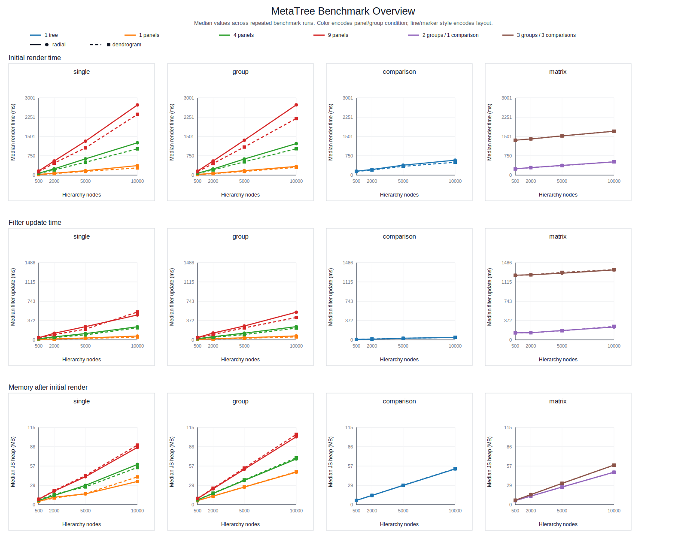

# MetaTree Benchmark Workflow

This directory contains the reproducible browser benchmark workflow used to evaluate MetaTree rendering and interaction performance for the manuscript revision.

The benchmark covers:

- `single` mode
- `group` mode
- `comparison` mode
- `matrix` mode
- `radial` and `dendrogram` layouts
- Hierarchies of approximately `500`, `2000`, `5000`, and `10000` nodes
- Multi-panel conditions with `1`, `4`, and `9` panels where applicable

## Published benchmark results

The latest full benchmark results are committed under `benchmark/outputs/`.

The committed public outputs are intentionally sanitized for repository release. They retain benchmark measurements and coarse environment descriptors, while omitting local filesystem paths, exact machine identifiers, detailed user-agent strings, and per-run wall-clock timestamps.

- Full run size: `72` conditions, `5` repeats each, `360` browser runs total
- Browser: Chrome `147.0.7727.101` in headless Chromium mode
- OS: Windows (`x64`)
- CPU: `13th Gen Intel(R) Core(TM) i9-13900H` (`20` logical cores)
- RAM: `32 GB`
- Viewport: `1600 x 1200`

The detailed machine-readable summary is in [outputs/summary.csv](outputs/summary.csv), and the narrative report is in [outputs/benchmark_summary.md](outputs/benchmark_summary.md).

Practical rerun instructions and workflow details are in [REPRODUCING.md](REPRODUCING.md).

## What was measured

Each condition records:

- data import time
- hierarchy construction time
- initial render time
- filter update time
- collapse/expand update time
- comparison computation time
- comparison-matrix render time
- post-render JavaScript heap usage

All timings are browser-side measurements based on `performance.now()`. Results are summarized with medians and interquartile ranges across repeated runs.

## Current benchmark highlights

- In `single` and `group` views, the largest `10000`-node, `9`-panel conditions took about `2.20-2.73 s` for initial rendering, while the corresponding `1`-panel conditions remained at about `0.28-0.37 s`.
- In pairwise `comparison` mode at `10000` nodes, median initial render time was about `0.50-0.58 s`, with significance-filter and collapse updates both staying below `50 ms`.
- In `matrix` mode, the `2`-group case scaled from about `246 ms` at `500` nodes to about `513 ms` at `10000` nodes. The larger `3`-group matrix took about `1.70 s` end-to-end at `10000` nodes.
- For the `3`-group matrix, comparison computation itself remained much smaller than full matrix rendering, increasing from about `15 ms` at `500` nodes to about `138 ms` at `10000` nodes. This indicates that matrix latency is driven mainly by rendering and staged mini-tree drawing rather than by the statistical comparison step alone.
- Post-render JavaScript heap usage increased with hierarchy size and panel count, reaching about `85-104 MB` in the largest `10000`-node `9`-panel `single` and `group` conditions.

## Representative summary table

These rows summarize the largest-node conditions for each mode/layout combination.

| Mode | Layout | Condition | Initial render median (IQR) | Filter median (IQR) | Matrix render median (IQR) | Memory median (IQR) |
| --- | --- | --- | --- | --- | --- | --- |
| matrix | dendrogram | 10000 nodes, 3 groups / 3 comparisons | 1704.9 ms (15.3 ms) | 1351.0 ms (12.7 ms) | 1450.3 ms (20.3 ms) | 58.7 MB (0.0 MB) |
| matrix | radial | 10000 nodes, 3 groups / 3 comparisons | 1703.2 ms (19.9 ms) | 1345.9 ms (6.3 ms) | 1445.5 ms (13.6 ms) | 58.9 MB (0.2 MB) |
| group | dendrogram | 10000 nodes, 9 panels | 2198.5 ms (88.9 ms) | 430.2 ms (15.8 ms) | NA | 104.4 MB (0.0 MB) |
| group | radial | 10000 nodes, 9 panels | 2728.6 ms (69.2 ms) | 532.1 ms (48.4 ms) | NA | 100.9 MB (0.2 MB) |
| single | dendrogram | 10000 nodes, 9 panels | 2359.0 ms (210.2 ms) | 536.0 ms (159.1 ms) | NA | 88.5 MB (0.1 MB) |
| single | radial | 10000 nodes, 9 panels | 2725.6 ms (68.9 ms) | 479.3 ms (30.6 ms) | NA | 85.1 MB (0.1 MB) |
| comparison | dendrogram | 10000 nodes, 1 tree | 498.5 ms (13.5 ms) | 49.2 ms (5.3 ms) | NA | 53.4 MB (0.1 MB) |
| comparison | radial | 10000 nodes, 1 tree | 579.3 ms (3.7 ms) | 46.7 ms (1.6 ms) | NA | 53.1 MB (0.1 MB) |

## Figures

### Overview (render, interaction, memory)

